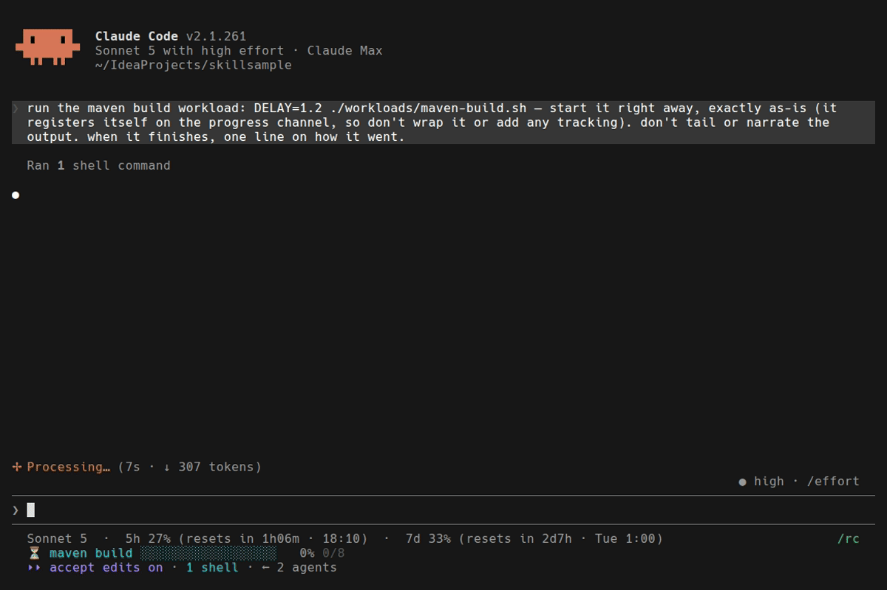
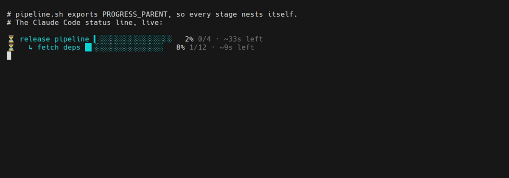
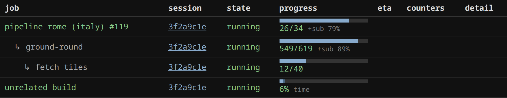
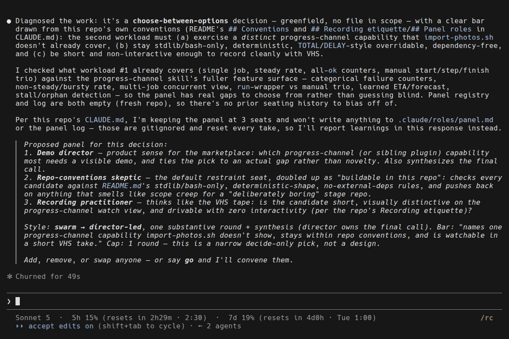
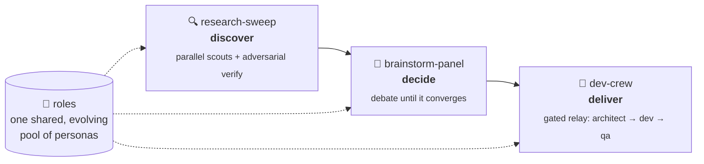
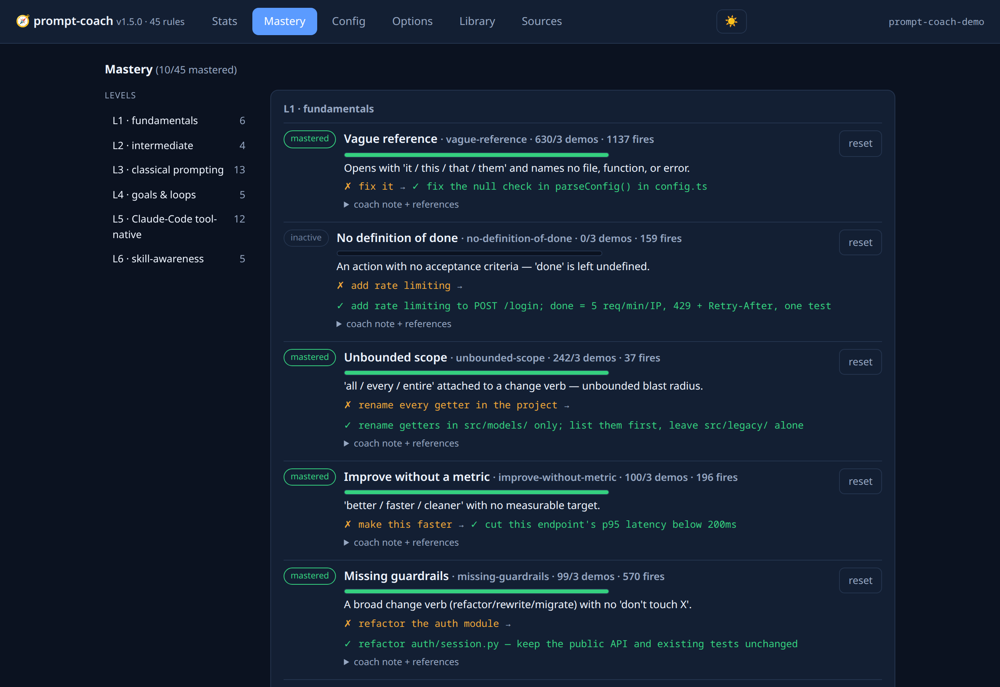
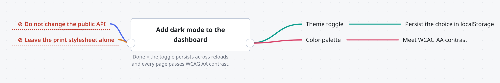
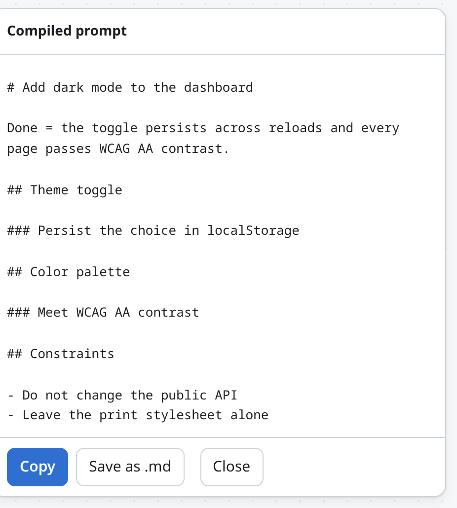
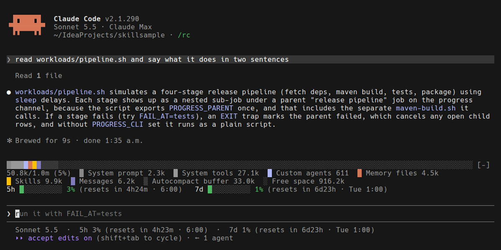
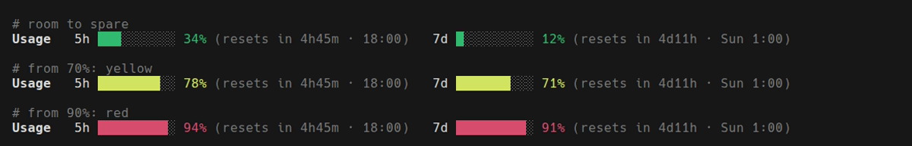

<div align="center">

# alexmskills

### Claude Code plugins that get better at *your* repo every time you use them.

[](https://github.com/alexmond/alexmskills/actions/workflows/validate.yml)
[](LICENSE)
[](https://www.alexmond.org/alexmskills/)
[](#the-catalog)
[](https://www.alexmond.org/alexmskills/codex/)



<sub>A real Claude Code session, recorded. The build registers itself — its live bar and learned time-left ride in the status line, where you're already looking.</sub>

**[Get started in 30 seconds](#get-started-in-30-seconds)** · **[Browse the catalog](#the-catalog)** · **[Read the docs](https://www.alexmond.org/alexmskills/)**

</div>

---

## Why this marketplace

<table>
<tr>
<td width="50%" valign="top">

**🧠 It learns, and writes it down.**
Skills keep what they learn in *your* repo, not in a chat that scrolls away. A CLAUDE.md that prunes and archives itself. Roles that accumulate lessons run after run. A coach that stops nagging about habits you've already mastered.

</td>
<td width="50%" valign="top">

**👥 Teams, not a single prompt.**
Three orchestrators compose role-specialized agents to fit the task — one to **discover**, one to **decide**, one to **deliver** — and they share one evolving pool of personas.

</td>
</tr>
<tr>
<td valign="top">

**📡 You can watch it work.**
Live progress in the status line and a local dashboard. Every demo below is a recording of the real tools running — two of them inside real Claude Code sessions — not a mock-up.

</td>
<td valign="top">

**✅ Measured, not asserted.**
Rule-based plugins cite a source for every rule and calibrate against real prompt corpora and real repos before shipping. The script-backed plugins carry test harnesses, and CI validates the whole catalog on every push.

</td>
</tr>
</table>

---

## See it in action

### 📊 Every long job, one glance — `progress-channel`



A pipeline and its current step, nested. The parent's bar and time-left **roll up from the step that's running**, so a long stage never reads as a frozen bar. Nest a whole shell pipeline with one line — `export PROGRESS_PARENT=$T` — and every sub-script, even one that knows nothing about pipelines, files itself underneath.

- **No setup in Claude Code** — a built-in mod draws the bars above your prompt, and steps aside if you wire the status line instead.
- **Learned ETAs** from each job's own history, borrowed from similar jobs when the name is new.
- **Bars from the tool's own output** — Maven, Gradle, Cargo, Go, pytest, Jest, Docker, Ninja, CMake, .NET and more, read in passing by a transparent pipe tap.
- **Runnable integration examples** for shell, Python, Node, Go and Make in [`examples/`](plugins/progress-channel/examples).
- **Stall and orphan detection** from each job's own rhythm, not a fixed timeout.

<p>

</p>

<sub>▶ Also: <a href="plugins/progress-channel/demo/demo.gif">the terminal view</a> — <code>progress watch</code> and a pre-start forecast.</sub>

---

### 🎯 An expert panel on any problem — `brainstorm-panel`



<sub>A real session. Asked to pick this repo's next demo workload, it seats a director, a skeptic and a practitioner — each with a stated job — and debates to a decision.</sub>

Hand it a problem, a draft, or a half-formed idea. It **picks the experts the work needs** — a skeptic is always seated — chooses how they should argue, and runs generate → critique → refine until they converge. The panel learns which seats earn their place in your repo.

---

### 🔁 Discover → decide → deliver — the Role System



One `skeptic` is a verifier in the sweep, a seat on the panel, and the adversarial check in the crew — and everything it learns in one place goes with it to the others. Each orchestrator works on its own; together they chain. **[How the Role System works →](https://www.alexmond.org/alexmskills/role-system/)**

---

### 🧭 A coach that learns how you prompt — `prompt-coach`



It reads each prompt as you send it and, when one would go better, **rewrites it with you** — naming the rule and the fix. Mastery is earned by *using* the technique, not by avoiding the mistake. And rules know their model: advice that a newer Claude already follows by itself switches off on that model.

---

### 🗺️ Think in a map, ship a prompt — `mindmap-prompt`



<p align="center"><sub>↓ &nbsp;<b>Compile</b></sub></p>

<p align="center"></p>

Some ideas don't arrive in order. Drop them on a canvas, connect them, mark what must not change — then press **Compile** and the map becomes an organized prompt. The compiler is plain code, not a model: the same map always gives the same prompt.

---

### 📝 A CLAUDE.md that keeps itself current — `evolving-claude-md`

```text
📝 CLAUDE.md audit (23.2 KB total; 49 entries, 56 lines in Decisions & Learnings).
   Compaction RECOMMENDED.
🔎 CHANGELOG MIRROR: 28/49 entries (57%) name a version CHANGELOG.md already
   documents. A release is not a learning — keep only what the release TAUGHT
   (a constraint, a trap, a reversal) …
```

<sub>A real audit of this repo's own CLAUDE.md, shown at session start — yes, it's telling us to tidy up.</sub>

Decisions and gotchas land in a log with a format enforced on every edit. The log prunes, graduates stable lessons into conventions, archives the old, and **tells you when an entry has gone stale** — a path that no longer exists, a version that has moved on.

When the audit says it's time, **`/evolving-claude-md:compact`** proposes the whole clean-up as one reviewed edit — lessons graduate into standing rules *before* the rest is archived, so nothing worth keeping leaves the file.

---

## Mods

**Not skills — code that draws inside Claude Code itself.** A mod has no instructions for the model to read, costs no tokens, and makes no extra API requests. These two put what you'd otherwise have to ask for right above your prompt.



<sub>Both mods in one real session, recorded: your context window on top, your rate limits beneath.</sub>

| Mod | | Version | What it draws |
|---|:-:|---|---|
| [`context-bar`](plugins/context-bar) | 🧩 | 0.1.1 | Your context window as a stacked bar, a colour per `/context` category. |
| [`usage-bar`](plugins/usage-bar) | 🧩 | 0.2.1 | Your 5-hour and 7-day limits as bars: green, yellow, then red. |

**`context-bar`** answers "what is filling my window?" without you asking: one segment per category, with a token legend, refreshed after every turn from a local estimate. Toggle it with `/context-bar`.

**`usage-bar`** keeps your rate limits in view, and changes colour before they bite — green with room to spare, yellow from 70%, red from 90%:



<sub>The three states, drawn by the mod's own functions at sample percentages — a live recording can only show the state an account is really in.</sub>

```text
/plugin install context-bar@alexmskills
/plugin install usage-bar@alexmskills
```

`progress-channel` ships a third: its live job bars, drawn in the same band with `/progress-bar` to toggle. It comes with that plugin rather than as its own install.

Install both and both draw: each adds its rows and then lets the next mod draw its own. Mods need a Claude Code build that loads hooks modules, and are Claude Code only. **[How mods work →](https://www.alexmond.org/alexmskills/mods/)**

---

## The catalog

<sub>🧠 learns from use · 🔧 workflow · 🔍 research & review · 📚 domain knowledge</sub>

| Plugin | | Version | What it does |
|---|:-:|---|---|
| [`evolving-claude-md`](plugins/evolving-claude-md) | 🧠 | 1.9.0 | A CLAUDE.md that prunes, graduates and archives itself. |
| [`brainstorm-panel`](plugins/brainstorm-panel) | 🧠 | 1.3.3 | A task-fit expert panel that debates until it converges. |
| [`dev-crew`](plugins/dev-crew) | 🧠 | 1.3.1 | A task-fit delivery crew, run as a gated relay. |
| [`roles`](plugins/roles) | 🧠 | 1.4.1 | One evolving pool of personas, shared by every orchestrator. |
| [`prompt-coach`](plugins/prompt-coach) | 🧠 | 1.5.1 | Rewrites your prompts toward better habits; mastery is earned. |
| [`conductor`](plugins/conductor) | 🧠 | 0.1.1 | The main session's playbook while parallel agent lanes run. |
| [`learn-on-failure`](plugins/learn-on-failure) | 🧠 | 1.1.1 | Saves a lesson whenever a fix took more than one try. |
| [`memory-hygiene`](plugins/memory-hygiene) | 🧠 | 0.2.0 | Flags agent memory that the code now contradicts. |
| [`screenshot-sweep`](plugins/screenshot-sweep) | 🧠 | 1.1.0 | Reads the whole screenshot, not just the bug you came for. |
| [`skill-linter`](plugins/skill-linter) | 🧠 | 0.5.0 | Lints `SKILL.md` against published guidance, and checks `npx skills` will find it; every rule cited. |
| [`progress-channel`](plugins/progress-channel) | 🔧 | 0.8.1 | Every long job as a live bar above your prompt or in your status line. |
| [`ticket-triage`](plugins/ticket-triage) | 🔧 | 0.4.2 | Ranks the backlog and runs startable tickets in parallel. |
| [`implement-issue`](plugins/implement-issue) | 🔧 | 1.0.1 | GitHub issue → branch → implement → verify → PR. |
| [`screenshot-tour`](plugins/screenshot-tour) | 🔧 | 1.1.1 | A captioned, narrative-ordered screenshot deck of your product. |
| [`mindmap-prompt`](plugins/mindmap-prompt) | 🔧 | 0.2.4 | Sketch a mind map; compile it into an organized prompt. |
| [`maven-quality`](plugins/maven-quality) | 🔧 | 1.1.0 | Codestyle, PMD, JaCoCo and pre-commit for Maven/Java. |
| [`security-audit`](plugins/security-audit) | 🔧 | 1.1.0 | OWASP-style scan: injection, traversal, deserialization, secrets. |
| [`research-sweep`](plugins/research-sweep) | 🔍 | 1.2.2 | Parallel research agents, then adversarial verification. |
| [`review-agents`](plugins/review-agents) | 🔍 | 1.2.1 | Read-only review subagents for any stack: tests, PR review, dependency audit. |
| [`spring-batch`](plugins/spring-batch) | 📚 | 0.1.1 | Spring Batch 5/6, grounded in runnable samples. |

Two plugins in progress ship with a `-beta` suffix: `tune-repo-beta` and `systemic-fix-beta`.

---

## Get started in 30 seconds

```text
/plugin marketplace add alexmond/alexmskills
/plugin install progress-channel@alexmskills
```

Then just ask:

| Say this | And you get |
|---|---|
| *"make CLAUDE.md evolve"* | `evolving-claude-md` sets up a self-maintaining decisions log, with hooks that register themselves. |
| *"get a team on this and make it better"* | `brainstorm-panel` proposes a panel for your sign-off, then runs the debate. |
| *"run the crew on this feature"* | `dev-crew` composes a roster and relays it, stopping at hard gates. |
| *"set up the progress status line"* | `progress-channel` wires live bars into your Claude Code status line. |

<details>
<summary><b>Every install command</b></summary>

```text
/plugin install evolving-claude-md@alexmskills
/plugin install memory-hygiene@alexmskills
/plugin install dev-crew@alexmskills
/plugin install brainstorm-panel@alexmskills
/plugin install learn-on-failure@alexmskills
/plugin install roles@alexmskills
/plugin install prompt-coach@alexmskills
/plugin install screenshot-sweep@alexmskills
/plugin install skill-linter@alexmskills
/plugin install implement-issue@alexmskills
/plugin install maven-quality@alexmskills
/plugin install security-audit@alexmskills
/plugin install mindmap-prompt@alexmskills
/plugin install screenshot-tour@alexmskills
/plugin install progress-channel@alexmskills
/plugin install context-bar@alexmskills
/plugin install usage-bar@alexmskills
/plugin install ticket-triage@alexmskills
/plugin install review-agents@alexmskills
/plugin install research-sweep@alexmskills
/plugin install spring-batch@alexmskills
/plugin install conductor@alexmskills
/plugin install tune-repo-beta@alexmskills
/plugin install systemic-fix-beta@alexmskills
```

Or browse with `/plugin` (Discover tab). Pull updates with `/plugin marketplace update alexmskills`.
Try one without installing: `claude --plugin-dir ./plugins/dev-crew`.

</details>

**Using Codex?** Every plugin also ships a Codex manifest, and the repo carries a second marketplace at `.agents/plugins/marketplace.json`. 9 plugins port as-is, 6 ship a Codex tool translation, and 9 depend on Claude Code hooks — the two mods among them, which are Claude Code only. **[Codex compatibility →](https://www.alexmond.org/alexmskills/codex/)**

---

## Learn more

📖 **[Full documentation](https://www.alexmond.org/alexmskills/)** — one page per plugin, the Role System, and Codex compatibility · 📜 **[Changelog](CHANGELOG.md)**

<details>
<summary><b>For maintainers and contributors</b></summary>

**Versioning.** Claude Code versions per *plugin*, not per skill. Each plugin carries a semantic `version` in its `plugin.json` and a matching entry in [`marketplace.json`](.claude-plugin/marketplace.json). Users on a pinned version only receive an update when the number changes. Tightly coupled skills (like `maven-quality`'s) share one plugin; everything else moves independently. Record every bump in [`CHANGELOG.md`](CHANGELOG.md).

**Beta plugins.** In-progress plugins live in the same marketplace with a `-beta` suffix, so it's obvious at install time. Graduation renames the directory, drops the suffix and bumps the version — `prompt-coach` graduated this way on 2026-07-28.

| Command | Purpose |
| --- | --- |
| `make validate` | Validate the marketplace, every manifest, docs coverage and this README's catalog. Runs in CI. |
| `make list` | Print the catalog. |
| `make bump PLUGIN=<name> VERSION=<x.y.z>` | Bump a plugin's version in both manifests together. |
| `make graduate PLUGIN=<name>-beta` | Graduate a beta plugin. |
| `make codex` | Regenerate the Codex manifests from the Claude-side source. |
| `claude plugin tag --dry-run plugins/<name>` | Check a plugin's manifest agrees with its marketplace entry. |

**Contributing a plugin.** Add it under `plugins/<name>/` with a `.claude-plugin/plugin.json` and a `skills/` and/or `agents/` directory, register it in `.claude-plugin/marketplace.json`, add a docs page under `docs/modules/ROOT/pages/` with a `nav.adoc` entry, and run `make validate`.

Docs are an Antora component under [`docs/`](docs), published by the [alexmond.github.io](https://github.com/alexmond/alexmond.github.io) site build. Demos run against [skillsample](https://github.com/alexmond/skillsample), a small stage repo, and are recorded with [VHS](https://github.com/charmbracelet/vhs); each `.tape` source sits next to its GIF.

</details>

## Provenance & attribution

All plugins in this marketplace are **original work by Alex Mondshain**, MIT-licensed — authorship is
recorded in each plugin's `plugin.json` (`author`) and the repo [LICENSE](LICENSE). One third-party
**inspiration** is credited: the `roles` plugin's persona set was seeded by a public prompt thread from
[@nahidulislam404](https://x.com/nahidulislam404) on X — the wording here is generalized and rewritten,
but that thread sparked the original set.

## License

[MIT](LICENSE) © Alex Mondshain
